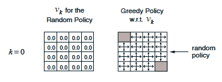

## Summary

__First step of policy iteration in gridworld example(Sutton and Barto, 2017)__ [textbook](https://s3-us-west-1.amazonaws.com/udacity-dlnfd/suttonbookdraft2018jan1.pdf)
### Introduction
- In the __dynamic programming__ setting, the agent has full knowledge of the MDP. (This is much easier than the __reinforcement learning__ setting, where the agent initially knows nothing about how the environment decides state and reward and must learn entirely from interaction how to select actions.)

### An Iterative Method
- In order to obtain the state-value function $v_π$ corresponding to a policy $\pi$, we need only solve the system of equations corresponding to the Bellman expectation equation for $v_π$
- While it is possible to analytically solve the system, we will focus on an iterative solution approach.

### Iterative Policy Evaluation
- __Iterative policy evaluation__ is an algorithm used in the dynamic programming setting to estimate the state-value function $v_π$ corresponding to a policy $\pi$. In this approach, a Bellman update is applied to the value function estimate until the changes to the estimate are nearly imperceptible.

### Estimation of Action Values
- In the dynamic programming setting, it is possible to quickly obtain the action-value function $q_π$ from the state-value function $v_π$ with the equation: $q_\pi(s,a) = \sum_{s'\in\mathcal{S}, r\in\mathcal{R}}p(s',r|s,a)(r+\gamma v_\pi(s'))$

### Policy Improvement
- __Policy improvement__ takes an estimate $V$ of the action-value function $v_π$ corresponding to a policy $\pi$, and returns an improved (or equivalent) policy $\pi'$, where $\pi' ≥ \pi$. The algorithm first constructs the action-value function estimate $Q$. Then, for each state $s\in\mathcal{S}$, you need only select the action $a$ that maximizes $Q(s,a)$. In other words, $\pi'(s) = \arg\max_{a\in\mathcal{A}(s)}Q(s,a)$, for all $s\in\mathcal{S}$

### Policy Iteration
- __Policy iteration__ is an algorithm that can solve an MDP in the dynamic programming setting. It proceeds as a sequence of policy evaluation and improvement steps, and is guaranteed to converge to the optimal policy (for an arbitrary finite MDP).

### Truncated Policy Iteration
- __Truncated policy iteration__ is an algorithm used in the dynamic programming setting to estimate the state-value function $v_π$ corresponding to a policy $\pi$. In this approach, the evaluation step is stopped after a fixed number of sweeps through the state space. We refer to the algorithm in the evaluation step as __truncated policy evaluation__.

### Value Iteration
- Value iteration is an algorithm used in the dynamic programming setting to estimate the state-value function $v_π$ corresponding to a policy $\pi$. In this approach, each sweep over the state space simultaneously performs policy evaluation and policy improvement.

